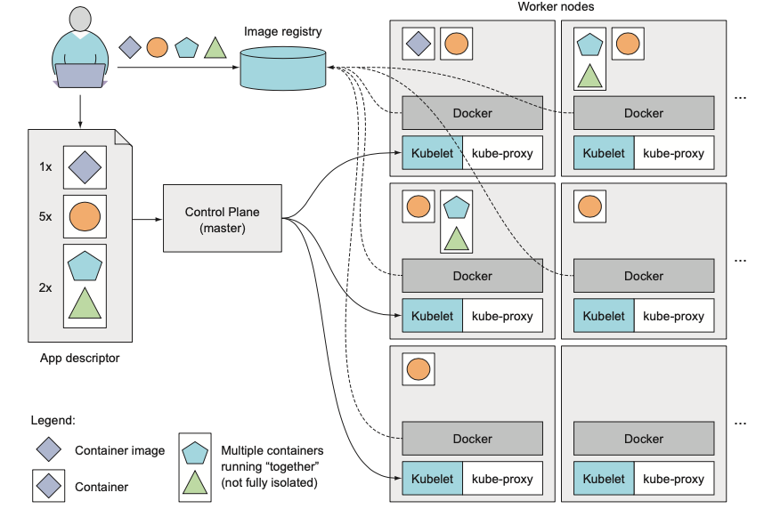

这里是 _Kubernetes in Action_ 的读书笔记。
### Chapter 1 介绍K8s
为什么需要K8s?  
- 因为由单体式程序(monolithic)转向微服务式程序，因此需用像K8s这种工具帮助开发者和运维团队。  
- 微服务通过水平扩容来提高请求处理能力，要求能运维上能迅速扩容/缩容。
- 不同的微服务依赖于不同版本的库甚至环境，对于这些资源的隔离需用docker以及K8s这类工具。
- K8s能实现运维的自动化，docker减小了开发，测试和线上环境的差异，为应用提供一个更稳定的环境。
- ...

Docker通过Unix/Linux的命名空间(namespace)实现比VM更轻量的资源隔离。Docker的主要概念包括下面三个。
- images: 将应用和环境打包的产物
- registries: 存储Docker image的仓库
- containers: 通过Docker image创建的Linux容器

Docker images是由多层(layers)组成的，不同的images可以包含相同的层。image的层是只读的，因此共享同一层的不同容器可以看到相同的文件系统，但是不能看到对方的修改。修改会作为一个新层加上去。

#### K8s的结构
K8s由master和worker node(s)组成。Master上运行着control plane，控制和管理整个K8s系统，worker nodes真正运行部署的应用。  
Control Plane
- Kubernetes API Server: 用户和control plane其他组件交互的工具。
- Scheduler: 为需要部署的应用调度worker nodes。
- Controller Manager: 执行集群级别的工作，例如复制组件，追踪worker nodes，处理节点失败等情况。
- etcd: 一个强一致配置中心。

Nodes
- container runtime: docker, rkt等运行容器的。
- Kubelet: 和API Server交互，管理本node上的容器。
- kube-proxy: 负责管理应用之间的网络。

用户通过声明需要部署什么应用，各需要多少各replica，每个应用的image应该如何获取。K8s会自己决定应该把各个应用实例调度到那个node上。


### Chapter 2 开始使用K8s和Docker
#### 简单使用Docker
运行一个Docker容器
```
docker run busybox echo "Hello world"
```
这条命令背后是
1 Docker检查本地是否存在busybox镜像
2 Docker从registry拉取busybox镜像
3 Docker在一个被隔离的容器里面运行''' echo "Hello world" '''

但是镜像一般是和想要运行的命令一起打包的，因此一般只要run一个打包进命令的image就可以了。
```
docker run <image>:<tag>
```
例如，如果有一个node.js编写的http server源文件app.js，想要这个http server在容器中运行。可以提供像这样的一个Dockerfile。这个Dockerfile应该和app.js在一个文件夹下
```
FROM node:7 // base image
ADD app.js /app.js //表示将当前目录的app.js加入镜像的根目录下
ENTRYPOINT ["node", "app.js"] //运行镜像时应该执行的命令
```
运行下面的命令制作一个镜像。
```
docker build -t kubia .
```
.表示基于当前目录制作image。在这个制作镜像的过程中，Docker将当前这个目录上传到Docker Daemon，Docker Daemon如果本地没有base image就去拉取，然后制作出新镜像。因此不要往文件夹里面放无用的文件。  

镜像不是一个大的二进制blob，而是由多层组成的。每个Dockerfile中的command都会在base image上再加一层。例如上面的Dockerfile中的ADD会给node:7增加一个layer，CMD会给它再增加一个layer。  

除了依靠Dockerfile，也可以手动制作镜像：拉起一个image，进去容器运行命令，退出后提交image即可。事实上Dockerfile也是这么做的，但是使用Dockerfile可以让以后制作同样镜像的行为自动化。

```
docker run --name kubia-container -p 8080:8080 -d kubia
```
这个命令让Docker运行一个名为kubia-container的容器，镜像为kubia。-d表示这个容器会与控制台分离(detached)，即在后台运行。宿主机的8080端口会映射到容器的8080端口。对于win和mac，docker的宿主机是运行Docker Daemon的VM，可以通过DOCKER_HOST环境变量查看它的IP地址。  

```
docker ps // list running containers
docker inspect container_name //输出一个json文档对容器进行详细描述
docker exec -it container_name bash // -i表示打开STDIN，-t表示分配一个伪终端(TTY)
docker stop container-name //仅仅是stop的，可以通过docker ps -a看到
docker rm container-name //彻底移除这个容器
```

容器中的pid使用的是自己的namespace，因此要运行的命令的pid为1。在宿主机上也能看到容器中运行的进程，但其pid必然不是1。

##### 把image推到image registry上
按照Docker Hub要求，image的tag应该由Docker Hub ID开头，可以通过```docker tag kubia luksa/kubia```给这个image增加一个tag，这里并不是将image重命名了。通过```docker images```可以看到现在是同一个image拥有两个tag。

```
docker push luska/kubia
docker run -p 8080:8080 -d luksa/kubia //如果本地没有则从Docker Registry拉取镜像
```

#### 简单使用K8s
首先应该有一个K8s集群，可以通过Minikube或者GKE等创建。  
如图，用户通过kubectl与K8s集群交互。


##### 通过K8s部署应用
```
kubectl run kubia --image=luska/kubia --port=8080 --generator=run/v1
```
这条命令创建了一个名为kubia的replication controller，K8s中不直接创建pod，而是用过创建replication set或者deployment来创建pod。选项```--genertator=run/v1```表示这里创建的是一个replication controller而不是deployment。```--port=8080```表示这个应用监听8080端口。

Pod是若干相关联的容器组成的组，因此一个pod中可以有多个容器。每个容器运行一个进程，这些进程就像运行在一台物理机上一样。Pod是K8s的基础构建模块，但K8s一般不直接创建pod。

在上面这个命令中发生了以下几步
1 kubectl发出一个RESTful call给API Server
2 master node创建一个pod并将其调度到一个worker node上
3 被调度的worker node的kubelet看到pod被调度来，驱使Docker去拉镜像
4 Docker运行image，创建容器


但刚刚部署的服务仅能通过pod的cluster ip访问到，但是pod是短命的，因此这个服务的ip随时可能变动。因此通过service为这个应用暴露一个持久稳定的ip地址。因为svc分配到的ip在它的整个生命周期都不会变。或者说，因为svc生命周期长，所以它的ip很稳定。svc代表的是运行同一类服务的1个or多个pods的一个静态地址。
```
kubectl expose rc kubia --type=LoadBalancer --name kubia-http
```

命令```kubectl expose```暴露了一个名为kubia-http的服务(service)，通过```kubectl get svc```可以看到这个svc的external ip，现在就可以通过这个external ip访问pod上的服务了。

在上面的例子中，```kubectl run```创建了一个replication controller，这个rc维护数量为1的pod。为了让这个pod能被K8s外界访问到，命令K8s将所有由这个rc管理的pod暴露为一个服务。


Replication Controller可以通过命令快速水平扩容/缩容。
```
kubectl scale rc kubia --relicas=3
```
### Chapter 3 Pod
Pod是K8s的中心概念，K8s的其他资源不是管理，暴露Pod，就是被Pod使用。  
Pod是一组容器，但大多数情况下pod里只有一个容器。如果pod中含有多个容器，则它们一定运行在同一个worker node上。  
多个运行单进程的**容器**优于运行多进程的单容器，因为容器没有管理进程的功能，如果诸多进程中的一个挂了，容器不能自行把它拉起来。另外多个进程在一个容器里会共用很多资源。例如stdout，这些进程的log会都挤在一起，无法分辨。  
容器设计之时就是为了运行单进程的，除非是一个进程自己引发的子进程的情况。因为必须保证单个容器单个进程，但由存在需要多个进程协同工作的情况。因此pod通过囊括多个容器来填补这个空白。  
K8s通过令一个pod上的所有容器使用相同的Linux namespace来模拟多个容器运行在一台物理机的情况。但是每个容器拥有其各自的文件系统，可以通过K8s的Volume令其共享一套文件系统。另外因为一个pod的多个容器相当于运行在一台物理机上，因此它们应该注意端口冲突的问题。  
Pods间的网络是平的，即它们可以通过ip地址直接找到对方，不需要通过NAT。无论是同一worker node上的pods还是不同worker nodes上的pods都是如此。

Pod是K8s扩展的最小单位，而不是容器。因此应该把不同的进程放在不同的pod中，这样扩展比较方便。比如无状态的web server和后端数据库就应该分开，这样web server扩容时，数据库不应该随之增减实例。  
但是如果是一个主要进程和若干个负责辅助其工作的进程，那么就可以放在一个pod中。  

总之，牢记尽量避免把多个进程放在一个容器，以及把多个容器放在一个pod就可以了。

##### 通过YAML或JSON来创建pod
[K8s API doc](http://kubernetes.io/docs/reference/)

通过```kubectl get po pod-name -o yaml```可以看到这个pod完整的yaml definition。一个yaml definition的主要内容包括
1 本yaml文件使用的K8s API version以及本yaml文件描述的资源类型
2 Metadata: 关于这个pod的信息，如name，namespace，label等
3 Spec: pod实际内容的描述，比如这个pod有什么容器，volume等
4 Status: 包含正在运行的pod的状态, 比如它现在运行正常吗，它的内部ip等其他基础信息

Pod的yaml definition内容很丰富，在用yaml创建pod的时候不用提供4。下面是一个创建pod的yaml的样例。
```
apiVersion: v1
kind: Pod
metadata:
  name: kubia-manual 
spec:
  containers: //这个pod包含1个容器
  - image: luksa/kubia
    name: kubia //给这个容器一个名字
    ports:
    - containerPort: 8080
      protocol: TCP
```
在yaml文件中指明port与否对于能不能通过这个端口个连上容器里面的服务没有影响，只不过可以让看yaml的人看得更明白。

在撰写manifest的时候，除了可以参考K8s API的文档，还可以利用```kubectl explain```命令查看各字段的含义。例如
```
kubectl explain pods
kubectl explain pod.spec
```

若想通过yaml文件创建pod，运行```kubectl create -f kubia-manual.yaml```即可。

在部署应用后希望查询应用的日志，调用```kubectl logs pod_name```或者登陆到worker node运行```docker logs <container_id>```。容器中的进程一般把日志直接写到stderr和stdout，而不是日志文件中。因为这样对于K8s和Docker可以直接获得日志。日志每天以及每10MBrotate一次，```kubectl logs```展示的是从上一次rotate到现在的日志。  
如果一个pod里面有多个容器，那么查询日志时应该指定容器名，即
```kubectl logs <pod_name> -c <container_name>```  
K8s只能查到还存在的容器的日志，如果想要保留被删除的容器的日志，需要一个cluster维度的日志中心(Ch17)。  

虽然pod创建成功，但是其中的服务还是无法访问。除了之前说的service，端口转发(port forwarding)也可以让用户可以访问到pod中的服务。端口转发是让用户通过本地的端口访问服务，service是给pod暴露了一个持久稳定的ip，无需端口，仅用ip即可。  
```
kubectl port-forward kubia-manual 8888:8080
```
运行了该命令后，kubectl会拦截本地8888端口的请求，转发到kubia-manual这个pod的8080端口。

##### 用label管理pods
Label是用户给K8s资源打上的任意键值对。一般会在创建资源的时候指定label，但是之后也可以热增加or热修改label。  
Label可以在些yaml文件的时候就写好。
```
...
metadata:
  name: kubia-manual-v2
  labels:
    creation_method: manual
    env: prod
...
```
运行下面命令查看label。
```
kubectl creata -f kubia-manual-v2
kubectl get po --show-labels 
kubectl get po -L creation_method,env \\ -L选项指定labels
```
修改或增加label的命令
```
kubectl label po kubia-manual-v2 env=debug --overwrite //必须带--overwrite选项才能修改已有label
```

###### label selector
使用```-l```选项加上条件可以通过label筛选资源。  
```
kubectl get po -l creation_method=manual / env / '!env' / != / in (a, b) / notin (a,b) ...
```

同样也可以通过label管理worker node。  
```
kubectl label node <node_name> gpu=true
```
使用```nodeSelector```可以把pod指定调度到符合某个label selector的worker nodes上。
```
spec:
  nodeSelector:
    gpu: "true" //这个pod只会被调度到包含gpu=true的node
  containers:
```
每个node都有一个名为kubernetes.io/hostname的label，这个label的值是node是主机名。但是没有必要不要使用这个label来调度pod，因为这样使pod对单个node依赖。

###### 注解pod
Annotating与label的区别在于
1 它的值可以很长，因为它是用来说明注解pod的键值对
2 它对于调度无影响
Annotations经常也被用于引入新feature。新的feature在beta阶段往往在annotation中出现。
```
kubectl annotate pod <pod_name> <key>=<value>
```

##### 使用命名空间对资源进行分组
Namespace的作用是把资源分组，资源的名称只需在命名空间内唯一即可。但是cluster级别的资源不受namespace控制，比如node。除了资源隔离外，namespace还可以用来做访问控制和资源管理。

可以用yaml文件创建namespace，也可以用命令。用命令比简单。
```
kubectl create namespace custom-namespace
```
切换namespace
```
kubectl config set-context $(kubectl config current-context) --namespace <namespace_name>
```

Namespace提供的隔离不是低级别的，即不同的ns的pod是可以互相看见对方的。ns的网络隔离依赖与K8s的网络策略，如果K8s没有做ns间的网络隔离，那么就没有隔离。

##### 停止和移除pod
```
kubectl delete po <pod_name>
kubectl delete po -l <label selector>
```
删除pod，K8s会终止这个pod的所有容器，K8s会向进程发送SIGTERM信号并等待一段时间。如果进程没有关掉，会再发送SIGKILL。因此应该保证容器中的进程可以处理SIGTERM信号。

也可以通过删除整个namespace来删除pod，删除ns可以删除ns上的所有pod。或者用```--all```选项。  
如果使用来```kubeclt delete all --all```来删除所有资源，第一个all就是表示所有资源。但是仍然会有一些资源不会被这个命令删除，需要显式删除，比如Secret。K8s service也会被这个命令删除，但是会再重新拉起来一个。


#### Chapter 4 Replication and other controllers
K8s可以在进程crash的时候重启容器，但如果进程没有crash，只是抛出错误或者进程出现了没有预料到的错误，比如死循环，死锁之类的该怎么办？因此要求可以从外部探查应用的健康状况。
有三种机制的探针：HTTP GET，要求返回状态码应该是2XX或者3XX；TCP socket，要求可以建立连接；运行容器内的一条命令，要求exit status code为0。  
不存在一个liveness探针这样的资源，而是在创建pod的时候附带创建探针。
```
apiVersion: v1
kind: pod
metadata:
name: kubia-liveness spec:
containers:
- image: luksa/kubia-unhealthy
    name: kubia
    livenessProbe:
      httpGet:
        path: /
        port: 8080
```
这个pod的yaml带了一个**httpGet**探针，要求K8s定期发送HTTP GET请求到8080端口来监测服务是否健康。  
查看restart的pod重启之前的日志用```kubectl logs <pod_name> --previous```  
这个容器的进程会每5次返回500一次，如果对这个pod用describe可以在Events看到因为探针失败而重启**容器**的记录。还可以看到上次被terminated的exit code，这个code 128+x，x是引发terminate的信号编号。  
Liveness探针的参数可配，比如超时时间，失败数目上限，还有探针在容器启动后多久开始工作(initialDelaySeconds)。 
探针的配置的一些注意点：
1 最好有一个/health之类的路径专门用来处理探针请求，监测整个服务的健康状况。
2 探针应该只检查服务的内部状态而不受外部应用影响，比如接数据库的web server，如果数据库坏了，server的探针不应该报失败。
3 探针应该轻量，因为探针会被高频次地运行，且探针的计算资源开销是计入整个pod的资源开销的。
4 探针自己不需要重试，因为K8s会自动重试探针。

因为探针失败而重启容器这件事是由承载这个pod的node上的kubelet负责的，K8s Control Plane不参与这个行为。但是如果这个node坏了，必须由Control Plane来为这个crash的node上面的所有pod找一个新的宿主机，但是手动创建的pod不由Control Plane管理，只有kubelet管理。因此需要Replication Controller之类的机制。

##### Replication Controller
rc是一种可以为pod维护指定replica数目的资源。rc会持续不断地监测符合某一个label selector的pod的数量，保证这个数量和设置的一样。  
一个rc由三个重要部分组成：
1 一个label selector，决定这个rc管理什么pod
2 一个replica count
3 一个pod template，用于创建新pod
更改rc的label selector和pod template对于正在运行的pod没有影响(变更label selector使得一些pod不受rc管理了应该也算影响才对)。

一个pod实例不会被挪到别的node，rc只会在一个新node上创建一个全新的pod来替代。  

用yaml来创造rc
```
apiVersion: v1
kind: ReplicationController
metadata:
  name: kubia
spec:
  replicas: 3
  selector:
    app: kubia 
template:
  metadata:
    labels:
      app: kubia
  spec:
    containers:
      - name: kubia
        image: luksa/kubia 
        ports:
        - containerPort: 8080
```
Pod template中的label必须和label selector中的一致，否则rc会不停地创建pod，所以个API server会检查这个点，如果不一致视为配置出错。可以不指定label selector，这种情况下会自动用template里面的label来作为selector。  

rc对于监控pod的变动是通过API server实现的，API server允许用户watch资源的变化，当rc注意到有新pod被创建或者删除的时候，这个创建或删除并不触发rc的去管理pod。rc会先用label selector查一遍自己管理的pod数目再作出反应。  

rc和pod不是强绑定的，rc只会管理符合label selector的pod。如果改变了一个pod的label，就可以实现将其移入移出rc的功能。不过虽然pod和rc不绑定，但是还是可以通过pod的```metadata.ownerReferences```查询到它属于什么rc。  

命令```kubectl edit rc <rc_name>```可以更改rc的yaml definition。这样可以更改rc的三个部分。但是如果单纯向扩展。可以用命令```kubectl scale rc <rc_name> --replica= ```。  

删除一个rc会一起删除这个rc管理的pod，但也可以不删除这些pod，这一点由```--cascade```选项控制。  

##### Replication Set
replication set是用来代替rc的，它几乎和rc一样，但是有更丰富的label selector支持。但是rs和rc一般也不都直接被创建，而是由一种更高级的资源deployment(Ch9)来自动创建它们。  

一个rs 的yaml definition。
```
apiVersion: apps/v1beta2
kind: ReplicaSet
metadata:
  name: kubia
spec:
  replicas: 3
  selector:
    matchLabels:
      app: kubia
  template:
    metadata:
      labels:
        app: kubia
    spec:
      containers:
      - name: kubia
        image: luksa/kubia
```
从这个yaml可以看出几点，一是rs的API版本不是v1而是apps/v1beta，apps是API group，v1beta是API version；其次是label selector用的是一个matchLabels。现在这个rs和之前的rc没有任何区别。但是rs提供下面的label selector已支持更丰富的label匹配。  
```
selector:
  matchExpressions:
    - key: app 
      operator: In 
      values:
	- kubia
```
这个operator可以在```In```, ```NotIn```, ```Exitsts```, ```DoesNotExist```中取值。如果使用的多个表达式和matchLabel，那么必须同时满足所有表达式才算匹配。  

##### DaemonSets
rc和rs只能控制pod的数目，但是如果希望每个node都能部署一个且仅一个pod这种需求它们满足不了。DaemonSets可以解决这个问题。  
DaemonSets创建的pods因为已经有了target node所以不需要Scheduler调度。  

DaemonSets也可以只在部分nodes上创建pod，这一项由pod template中的nodeSelector来管理。DaemonSets创建的pod忽略node的unschedulable状态，因为DaemonSets创建的pod不走Scheduler。而且这也很合理，因为DaemonSet管理的一般是系统服务，这些服务不关心这个node上是不是有pod。

```
apiVersion: apps/v1beta2
kind: DaemonSet
metadata:
  name: ssd-monitor 
spec:
  selector:
    matchLabels:
      app: ssd-monitor 
template:
    metadata:
      labels:
        app: ssd-monitor 
spec:
      nodeSelector:
        disk: ssd
      containers:
        - name: main
          image: luksa/ssd-monitor
```

##### Job 
之前的pod都是持续运行的，如果希望一个pod执行完工作就终止就需要Job这种资源。  
Job的容器当进程正常结束之后不会重启，而是被视为完成了。如果因为node崩溃这种情况造成由job管理的pod崩溃，job会在另外的node上重启一个pod重新做任务。如果是pod内的进程执行失败，job可能会重试任务或者什么也不做。  
```
apiVersion: batch/v1
kind: Job
metadata:
  name: batch-job 
spec:
  template:
    metadata:
      labels:
        app: batch-job 
    spec:
      restartPolicy: OnFailure 
      containers:
        - name: main
          image: luksa/batch-job
```
restartPolicy的默认值的```Always```，这是所有Pod的默认值。但是由Job管理的Pod不能设置为该值，因为它设计的目的是为一次性任务服务。可以配置为```OnFailure```或者```Never```。  
一个Job可以管理多个pod，这样可以并行或者顺序地执行多个任务，通过设置Job spec的```completions```或者```parallelism```来做到。如果设置```completions=5```，那么job就会顺序地运行5个pod。可以同时设置这两个属性使得Job并行地运行多个任务。还可以在Job工作期间热更新并行数。
```
kubectl scale job multi-completion-batch-job --replicas 3
```
限制Job中的任务的完成时间通过设置spec的```activeDeadlineSeconds```做到，重试上限通过```backoffLimit```设置。  

Job资源在创建之后会立刻工作，如果由定期或者希望未来完成的任务，可以使用CronJob。
```
apiVersion: batch/v1beta1
kind: CronJob
metadata:
  name: batch-job-every-fifteen-minutes 
spec:
  schedule: "0,15,30,45 * * * *"
  startingDeadlineSeconds: 15 \\因为CronJob不能精确地在设置时间执行，这里给一个延迟上限，超过会视为失败 
  jobTemplate:
    spec:
      template:
        metadata:
          labels:
            app: periodic-batch-job 
        spec:
  	  restartPolicy: OnFailure 
          containers:
 	    - name: main
	      image: luksa/batch-job
```
一般情况下，CronJob只会创建一个Job。但存在两个Job被同时创建或者有时候没有Job被创建的情况。因此需要保证你的任务的幂等的，并且任务可以完成上一轮没有做的工作。

#### Service


#### ConfigMaps and Secrets
如何将配置项传给K8s中运行的App  
1 命令行配置参数或者配置文件
2 通过环境变量

在Docker中使用配置文件会很麻烦，如果把配置文件集合到imgae里面，那么不安全，所有对image有权限的人都能看到配置文件内容，其次不好管理，因为要修改配置参数就要重新打镜像。用volume也差不多，需要保证容器拉起来前文件被写到volume了。用gitRepo可能好点，但没必要。因为有ConfigMaps。  
但是配置项里面可能还有一些敏感的参数，比如私钥等需要保密的。K8s提供了另外一种一等对象Secret来管理这些东西。  
##### 给容器传入命令行参数
在容器中执行的命令分为两部分，*command*和*argument*。在一个Dockerfile中，用  
**ENTRYPOINT**描述容器启动时应该运行什么命令  
**CMD**描述应该传给**ENTRYPOINT**的参数  
虽然**CMD**也可以用来运行命令，但是它正确的用法是给**ENTRYPOINT**传入参数。Docker镜像可以通过
```
docker run <image>
```
直接默认参数运行，也可以通过说明参数来覆盖**CMD**的值。
```
docker run <image> <arguments>
```

并且，这两种指令都支持**shell**和**exec**两种形式。
**shell**: ENTRYPOINT node app.js
**exec**: ENTRYPOINT ["node", "app,js"]  
它们两个的区别在于命令是否在一个shell里运行。  
如果shell中运行，那么PID 1的进程不是命令而是shell。  


